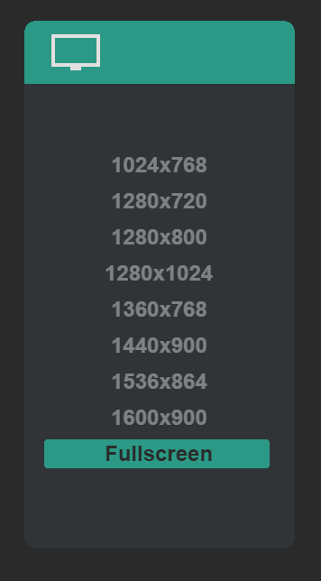
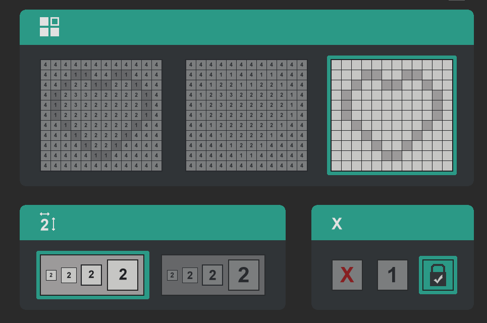
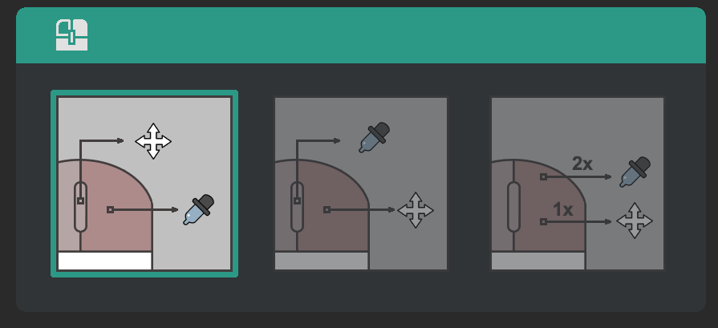

<a id="readme-top"></a>

<div align="center">
  <h2 align="center">Coloring game auto play</h2>

  A script that automatically plays [Coloring Game][ColoringGame] from [L. Stotch][LStotch] — style mini-games by analyzing pixel data and simulating user input.

  *P.S. At the moment, the script has been tested only on Little City and 2 parts. If it doesn't work for others, let me know. *

  
</div>
<br>
<!-- TABLE OF CONTENTS -->
<details>
  <summary id="contents">Table of Contents</summary>
  <ol>
    <li>
      <a href="#🧠-about-the-project">About The Project</a>
      <ul>
        <li><a href="#💭-inspiration">Inspiration</a></li>
        <li><a href="#👀-tests">Tests</a></li>
        <li><a href="#🔧-built-with">Built With</a></li>
      </ul>
    </li>
    <li>
      <a href="#✨-getting-started">Getting Started</a>
      <ul>
        <li><a href="#💾-install">Install</a></li>
        <li><a href="#⚙️-game-settings">Game settings</a></li>
      </ul>
    </li>
    <li><a href="#⌨️-controls">Controls</a></li>
    <li><a href="#📓-contact">Contact</a></li>
  </ol>
</details>


<!-- ABOUT THE PROJECT -->
## 🧠 About The Project

This project is a script for automatically completing a series of games [Coloring Game][ColoringGame]. The program finds the game window, takes a screenshot, determines the color areas on the playing field and automatically clicks the mouse to color them.

### 💭 Inspiration

I wanted to do this project after I started going through huge levels in Little City. I wanted get all the achievements, but the game itself was no longer so much fun to draw every pixel.

### 👀 Tests

The tests were performed taking into account the field search at the beginning of the program.

|  №  |     Name    |     JDE     |    Script    |   % Faster   |
|:---:|:------------|:------------|:-------------|:------------:|
|  1  | CGLCFREE.1  |  35s        |  14s         |   60.00%     |
|  2  | CGLCFREE.8  |  4:51s      |  1.07s       |   76.98%     |
|  3  | CGLCFREE.15 |  58:20s     |  10.14s      |   82.46%     |
|  4  | CGLC№2.1    |  50s        |  20s         |   60.00%     |
|  5  | CGLC№2.8    |  6:43s      |  1:50s       |   73.49%     |
|  6  | CGLC№2.15   |  1:33:20s   |  14:38s      |   84.32%     |


### 🔧 Built With

<a href="https://www.python.org/">
  
</a>

<p align="right">( <a href="#readme-top">to top</a> | <a href="#contents">to contents</a> )</p>

<!-- GETTING STARTED -->
## ✨ Getting Started

### 💾 Install
1. Make sure you have Python 3.9+ installed. You can download it from the official website<br>
    👉 https://www.python.org/downloads/

2. Clone the repo
   ```
   git clone https://github.com/h0usss/Coloring_game_auto_play
   ```

3. Create a virtual environment (optional)
    ```
    python -m venv venv
    venv\Scripts\activate  # Windows
    ```

4. Install the necessary libraries

    ```
    pip install -r requirements.txt
    ```

### ⚙️ Game settings


|    Picture 1    |    Picture 2    |    Picture 3    |    Picture 4    |
|-----------------|-----------------|-----------------|-----------------|
|  |  |  |  |

1. Before launching, make sure that the Coloring Game is open and active.

2. (optional) Open the game in full screen mode (Picture 1).

3. (optional) Set the cell display settings as shown in Picture 2.

4. Set the mouse settings as shown in Picture 3.

5. (optional) Set the brush mode to fill to speed up the process (Picture 4).

6. Run the script
    ```
    python main.py
    ```

7. Click `C` in Game.

8. Wait 5-15s while the canvas is being searched.

9. Enjoy!

## ⌨️ Controls
Press `C` to start or pause the work.<br>
Press `X` to stop the script and exit.<br>
Press `T` to up speed / down delay.<br>
Press `G` to down speed / up delay.

<p align="right">( <a href="#readme-top">to top</a> | <a href="#contents">to contents</a> )</p>


<!-- CONTACT -->
## 📓 Contact

hnoproblems@gmail.com

Project Link: [https://github.com/h0usss/Coloring_game_auto_play](https://github.com/h0usss/Coloring_game_auto_play)

<p align="right">( <a href="#readme-top">to top</a> | <a href="#contents">to contents</a> )</p>


[ColoringGame]: https://store.steampowered.com/publisher/lstotch/#browse
[LStotch]: https://store.steampowered.com/publisher/lstotch/